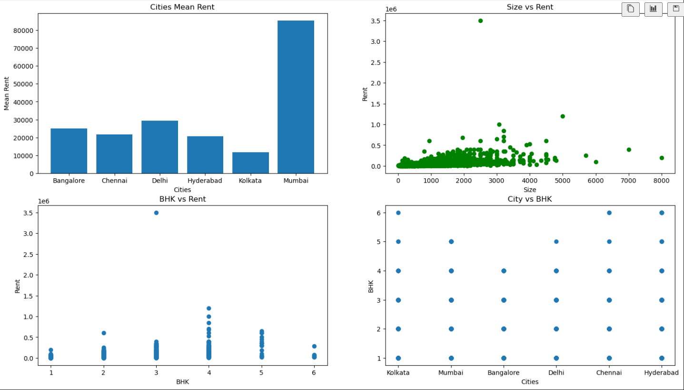
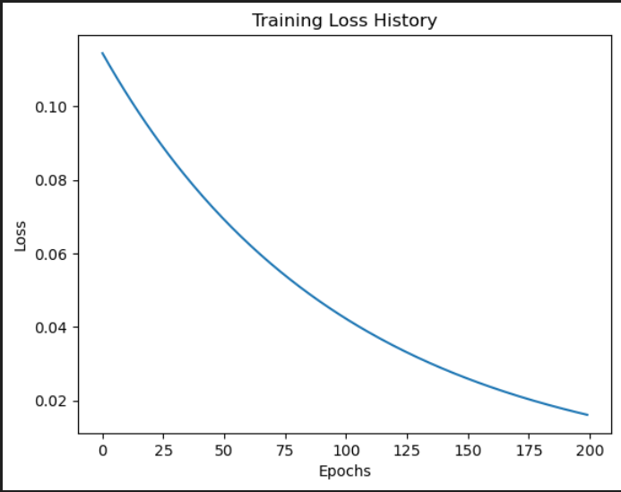

# House Rent Prediction Using Python
This is a prediction of house rents using numpy and python. It comprises of 7 features including BHK, Size, City, Area Type etc.

## Visualization

## Training
Training Loss = **1.62%**

## Testing
The model has test loss of **7%**